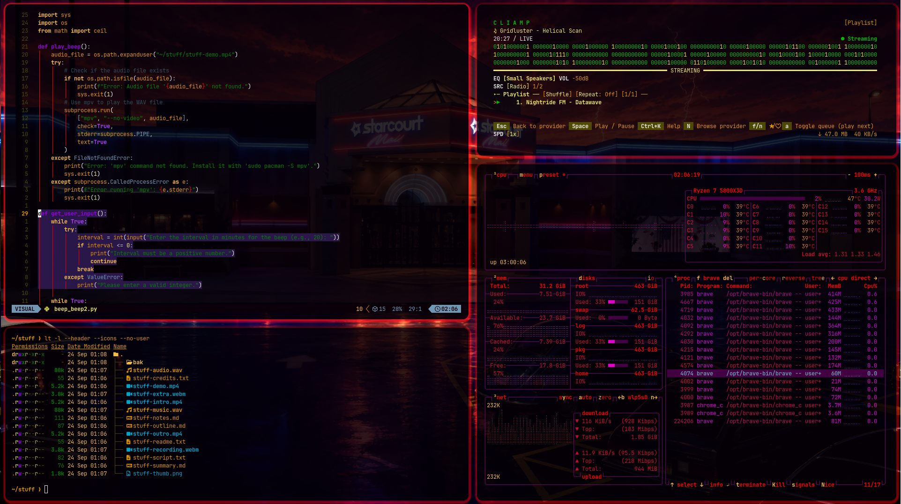
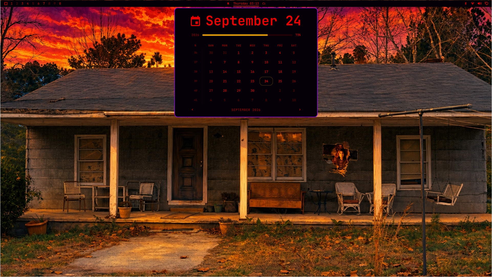

# A Stranger Theme





Initially a regular dark theme just for me, inspired by memories of an Amdek 300A monitor I poked at as a small kid. A pragmatic choice of amber/red gives me the most eye comfort in very low light settings while still being usable during much of the day. So winter '25, as I began to nerd out on all the paddles for my first theme curiosity voyage, there was clearly another influence taking shape (subconsciously) and I ran with it!

The original plan was to share this theme in the old .conf format when the last season of "Stranger Things" was finally released. Scheduling time around the holidays for an art project was tough. The delay was good though. Omarchy 4.X was a big jump with quickshell. This theme pays tribute to a tremendous story & space in time I hold close. The original 2025 wallpapers were gathered from various fan art sites. I deleted them all and worked on my own wallpapers fully unique to this theme. That said, each is based on key moments from the story. The goal is to have at least eleven. It took time to create & settle on the seven currently included. There will be more..

> [!NOTE]
> The screenshots above are the **full** desktop.
>
> **Meaning:** custom window animations, gaps, borders, rounding, glass terminals, and Amber Glow Neovim. There are two install paths. Use **Exact desktop** if you came here for that look. The website one-liner only paints the most basic colors. That is an Omarchy one-line install command rule, not a cut-down theme.

## Exact desktop (trusted copy or symlink)

For those who want the exact theme I designed for myself, here are new-to-linux friendly steps: open a terminal, paste each block, then Enter. For fun imagine Murray's voice going forward.

GitHub is only the library copy. Omarchy looks in `~/.config/omarchy/themes/`. We copy the theme there **without** the hidden `.git` folder so Omarchy treats it as your theme keeping the Lua, terminal glass, vscode look, and Neovim colors...

### 1. Get the library copy

Leave this folder alone after it downloads. Do not delete `.git` inside it.

```bash
git clone https://github.com/District-cHAP9Y/a-stranger-theme.git ~/Downloads/a-stranger-theme
```

### 2. Copy into Omarchy (no `.git`)

Folder name is `a-stranger-theme` (same as the repo). Stick with that name.

If you already ran the website install, you may have `~/.config/omarchy/themes/a-stranger` (the installer drops `-theme`). Remove that extra folder first so you are not running two copies:

```bash
rm -rf ~/.config/omarchy/themes/a-stranger
```

Then copy:

```bash
mkdir -p ~/.config/omarchy/themes/a-stranger-theme
rsync -a --exclude '.git' ~/Downloads/a-stranger-theme/ ~/.config/omarchy/themes/a-stranger-theme/
```

**Check:** this must print `No such file or directory`:

```bash
ls ~/.config/omarchy/themes/a-stranger-theme/.git
```

**Optional instead of copy:** if you want one folder forever, symlink the library copy:

```bash
ln -s ~/Downloads/a-stranger-theme ~/.config/omarchy/themes/a-stranger-theme
```

A symlink is also treated as your theme by the way, neat right. Next.

### 3. Turn it on

```bash
omarchy theme set a-stranger-theme
```

Or pick **A Stranger Theme** in the Omarchy theme list.

You should get: gaps 6, border size 3, rounding 13, shutter / slidefade window motion, terminal opacity 0.86, Amber Glow Neovim. Wallpapers are the seven story stills in `backgrounds/`.

Do **not** run `omarchy-theme-install` on this path. Do **not** delete `.git` inside `~/Downloads/a-stranger-theme`.

## For omarchy.org / git-install (bland version)

Palette, wallpapers, and shell colors only. Omarchy will ignore `hyprland.lua`, terminal configs, `neovim.lua`, and `vscode.json` because the clone still has a `.git` directory. Stock Omarchy animations stay. This command exists so the [themes listing](https://omarchy.org/themes/) can point at a public repo.

```bash
omarchy-theme-install https://github.com/District-cHAP9Y/a-stranger-theme.git
```

That installer names the folder `a-stranger`. For the real screenshot look, use **Exact desktop** steps above.

## Custom Bar hover icons (optional finishing touch)

> [!TIP]
> Stock Omarchy currently cements the status-bar hover icons color (recording, dictate, night light, DND, stay awake, reminders) to an active theme as bar text at 45% opacity. To match the color I designed, or to tweak that yourself, follow [bar-hover-icons.md](bar-hover-icons.md). That restyle is a local plugin clone: undo it before switching themes. The durable fix is an Omarchy theme key for inactive indicator color.

Feel free to run all that jazz by your favorite llm agent if you must. Your welcome

### License
MIT
